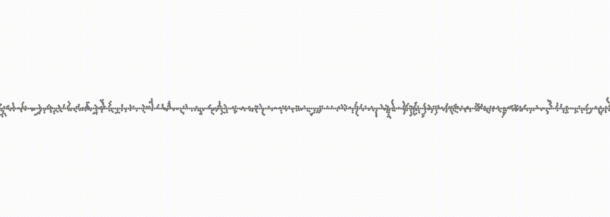
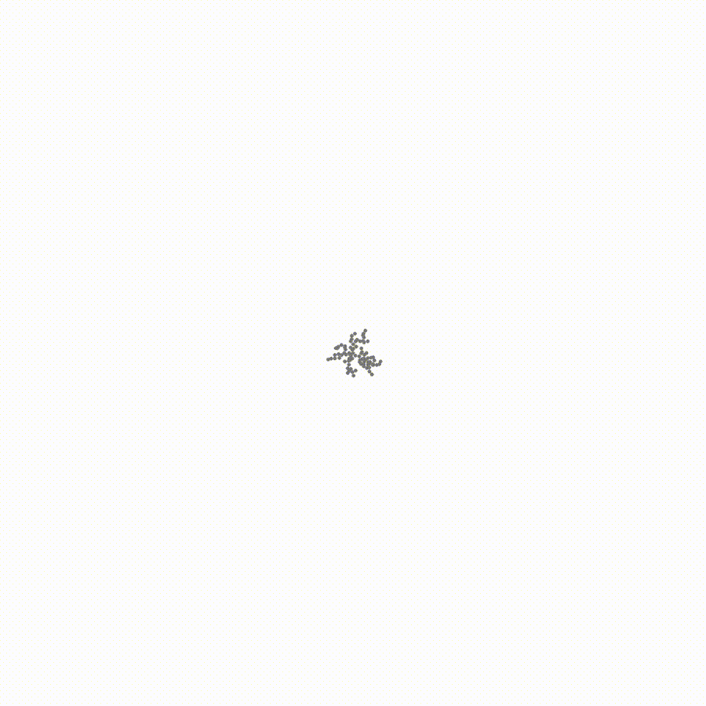

# 02 - directional bias

Similar setup as experiment 01, but with every walker given a "bias" force that continually pushes it in a particular direction. Depending on the direction of this force, an initial "wall" of initial cluster particles are set up to "catch" walkers as they move.

## Keyboard commands

In addition to the global keyboard commands listed in the main README, the following commands are available for this experiment:

| Key | Result                                                               |
|---  |---                                                                   |
| `1` | Bias towards bottom edge with cluster wall on bottom edge.           |
| `2` | Bias towards top edge with cluster wall on top edge.                 |
| `3` | Bias towards left edge with cluster wall on left edge.               |
| `4` | Bias towards right edge with cluster wall on right edge.             |
| `5` | Bias towards equator with horizontal cluster wall in screen center.  |
| `6` | Bias towards meridian with vertical cluster wall in screen center.   |
| `7` | Bias away from center with cluster walls on all edges.               |
| `8` | Bias towards center with centered cluster seed.                      |

## Samples

