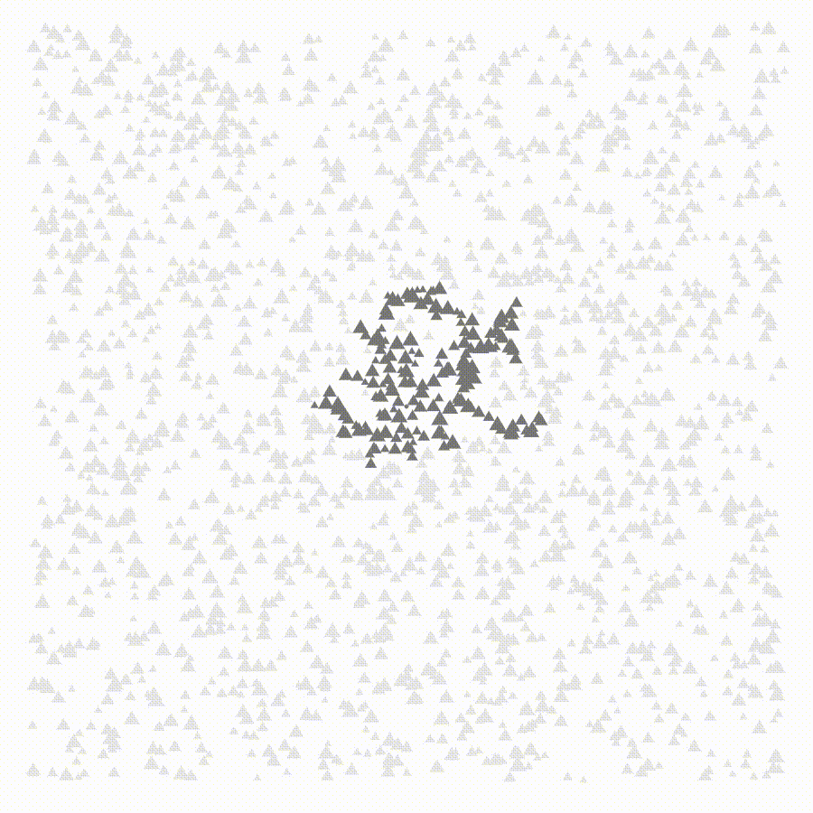
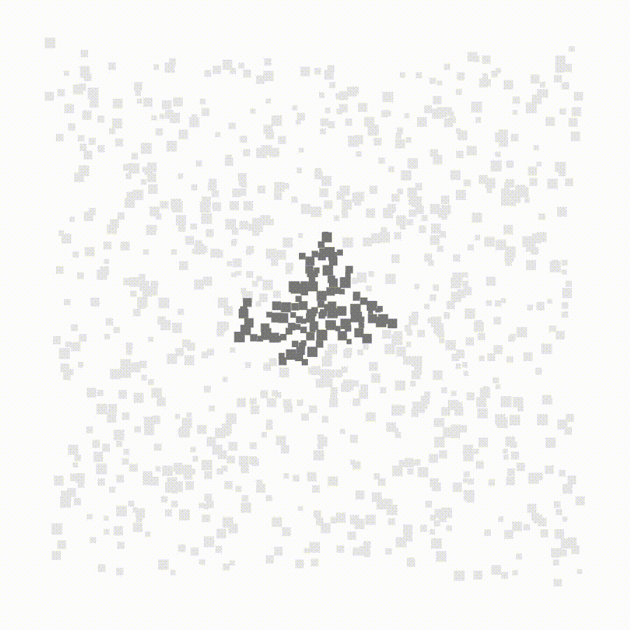

# 04 - different shapes

Walkers don't have to just be circles - they can be any polygon! This sketch shows 

## Keyboard controls

| Key | Result    |
|---  |---        |
| `1` | Triangles |
| `2` | Squares   |
| `3` | Pentagons |
| `4` | Hexagons  |

## Samples

