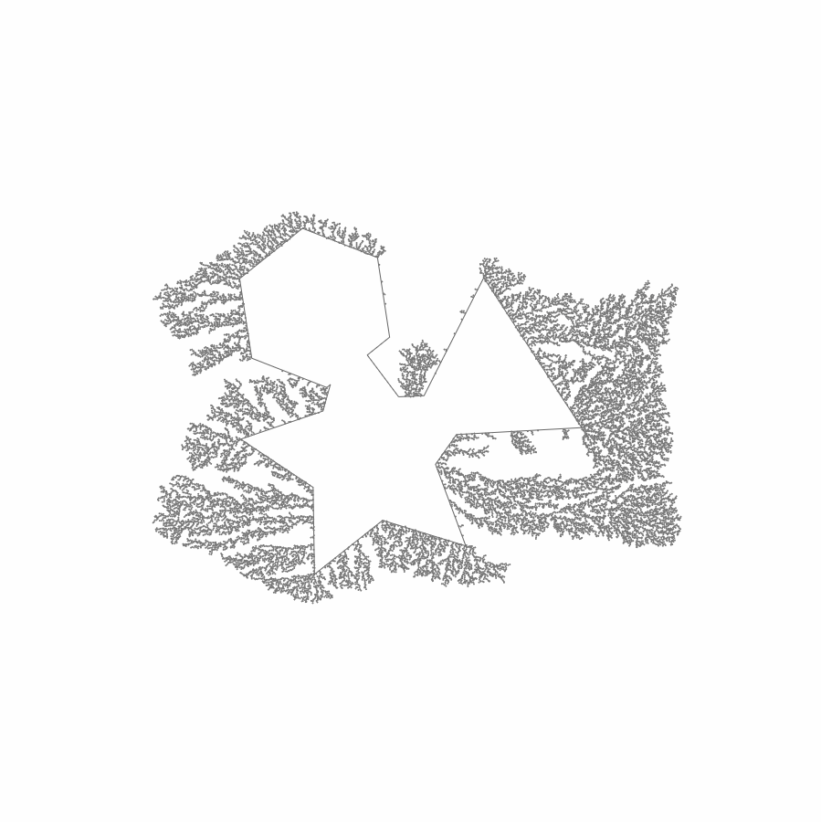

# 05 - SVG input

Using paths imported from simple SVG files as initial "seeds" for growth.

## Keyboard controls

| Key | Result |
|---  |---     |
| `1` | The letters 'DLA'              |
| `2` | A mashup of different polygons |

## Samples

