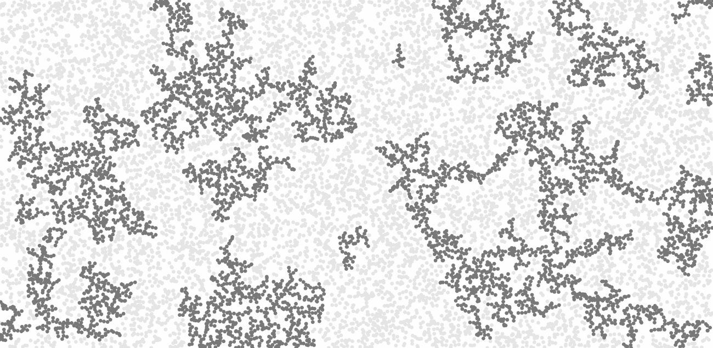
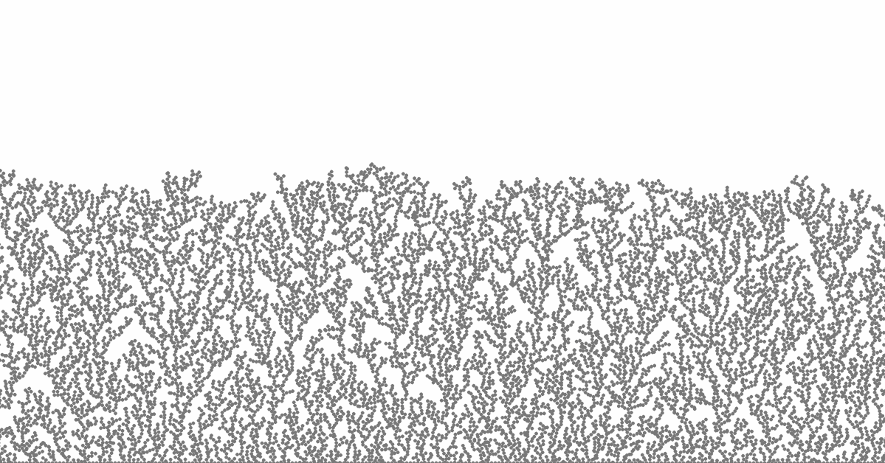
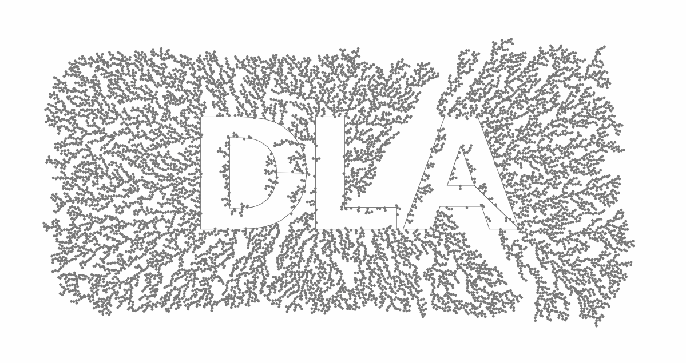

> [Read my Medium article](https://medium.com/@jason.webb/simulating-dla-in-js-f1914eb04b1d) to learn more about diffusion-limited aggregation and this project.
>
> [Additional media is available on my portfolio](https://jasonwebb.io/2019/05/diffusion-limited-aggregation-experiments-in-javascript)

This repo contains a series of visual experiments built with JavaScript that explore the topic of __diffusion-limited aggregation__ (DLA) as a method for generating interesting 2D forms.

I am particularly interested in the application of such techniques in the context of digital fabrication, so these experiments will be more focused on schematic representations (colorless, vector-based, SVG/STL exports) over purely visual effects.

## About diffusion-limited aggregation

_Diffusion-limited aggregation (DLA)_ is a process in which randomly-moving particles _diffuse_ through a medium and clump together (_aggregate_) over time to form long, fractal, branch-like chains (sometimes called [Brownian trees](https://en.wikipedia.org/wiki/Brownian_tree)). It closely models various interesting phenomena seen in nature at different scales and in different mediums.

A classic example is that of the formation of [copper sulfate crystals](https://upload.wikimedia.org/wikipedia/commons/b/b8/DLA_Cluster.JPG) in the presence of an electrodeposition cell. When electricity is applied, individual copper atoms are stripped from the system's anode and randomly float (_diffuse_) through the liquid medium until they come in contact with other copper atoms that have accumulated on the system's cathode where they form a strong molecular bond and aggregate over time.

Another example can be seen in the rather more violent phenomena of [Lichtenberg figures](https://en.wikipedia.org/wiki/Lichtenberg_figure), wherein an electrical discharge of very high voltage travels through an insulator like wood, burning a curious fractal branching structure in it's wake. In this example, it would seem that the electrical discharge itself _diffuses_ through the wood, _limited_ by the insulating nature of the wood, forming an _"aggregate"_ of burnt wood as it progresses.

### A note on lattices and parameterization
In classical implementations this algorithm acts upon a regular 2D grid of pixels wherein each "particle" can have up to 8 neighbors. Though simplistic, this so-called "on-lattice" approach can run at blistering speeds because no expensive distance calculations, spatial indexing, or collision detection is required - just array lookups.

However, this approach results in an inherently low fidelity raster image that has a pretty characteristic aesthetic style and limited usefulness in modern digital fabrication workflows. In the world of digital fabrication vector-based graphics are preferred because they can be easily transformed into machine toolpaths and manipulated in interesting ways in CAD software.

To achieve vector-based results from the DLA process one must move away from pixels and towards _particles_, which also affords one the ability for more parameterization that can be fun to explore creatively. For example, one could vary the size, shape, and movement behaviors of these particles to achieve interesting effects.

## Keyboard commands

| Key     | Result                                                      |
|---      |---                                                          |
| `w`     | Toggle visibility of walkers                                |
| `c`     | Toggle visibility of clustered particles                    |
| `s`     | Toggle visibility of custom SVG shapes                      |
| `r`     | Restart simulation                                          |
| `f`     | Toggle frame                                                |
| `l`     | Toggle line rendering effect                                |
| `e`     | Export and initiate download of current drawing as SVG file |
| `t`     | Toggle visibility of helpful text                           |
| `Space` | Pause/unpause simulation                                    |

## Parameters

| Parameter                   | Value       | Default       | Description |
|---                          |---          |---            |--- |
| `CircleDiameter`            | `Number`  | `5` | Default size of walkers, if none is provided through local Settings. |
| `InitialClusterType`        | `Point`, `Ring`, `Random`, or `Wall` | `Point` | Default initial cluster pattern, if none is provided through local Settings. |
| `ShowClusters`              | `Boolean` | `true` | Visibility of clustered particles on load. |
| `ShowWalkers`               | `Boolean` | `true` | Visibility of walkers on load. |
| `ShowShapes`                | `Boolean` | `true` | Visibility of custom SVG shapes on load. |
| `MaxWalkers`                | `Number` | `20000` | Maximum number of walkers - lower numbers mean better performance, but fewer hits. |
| `WalkerSource`              | `Edges`, `Circle`, `Random`, `Random-Circle`, or `Center` | `Center` | Where new walkers are spawned. |
| `ReplenishWalkers`          | `Boolean` | `false` | Add new walkers whenever they become stuck to clusters. |
| `BiasTowards`               | `Top`, `Bottom`, `Left`, `Right`, `Edges`, `Center`, `Equator`, or `Meridian` | `Center` | Direction to move all walkers each iteration. |
| `BiasForce`                 | `Number` | `1` | Magnitude of force to move walkers towards their bias direction. |
| `UseFrame`                  | `Boolean` | `true` | Constrain sketch to a box centered on the screen. |
| `FrameSize`                 | `Number` or `[width, height]` | `900` | Size of frame. |
| `CaptureLines`              | `Boolean` | `true` | Enable building of an internal buffer of line segments between all connected particles. Can be disabled if it impacts performance at large scales. |
| `RenderMode`                | `Shapes` or `Lines` | `Shapes` | Method of drawing particles. Can draw the shapes as they exist (`Shapes`), or only draw lines between connected particles (`Lines`). |
| `UseColors`                 | `Boolean` | `false` | Enable the use of colors defined by objects below. |
| `UseStroke`                 | `Boolean` | `false` | Draws all circles/polygons with a 1px stroke matching the background color. |
| `BackgroundColor`           | `Object` with `h`, `s`, `b` properties | | Color of canvas background in HSB format. |
| `WalkerColor`               | `Object` with `h`, `s`, `b` properties | | Color of walkers in HSB format. |
| `ClusterColor`              | `Object` with `h`, `s`, `b` properties | | Color of clustered particles in HSB format. |
| `ShapeColor`                | `Object` with `h`, `s`, `b` properties | | Color of custom SVG shapes in HSB format. |
| `LineColor`                 | `Object` with `h`, `s`, `b` properties | | Color of lines when using `Lines` for `RenderMode`. |
| `FrameColor`                | `Object` with `h`, `s`, `b` properties | | Color of frame, if enabled with `UseFrame`. |

## Packages used
* [p5.js](https://www.npmjs.com/package/p5) for canvas drawing and miscellaneous helper functions (like `lerp` and `map`).
* [Webpack](https://webpack.js.org/) for modern JS (ES6) syntax, code modularization, bundling, and serving locally.
* [collisions](https://www.npmjs.com/package/collisions) for robust, lightweight collision detection without the use of a full physics package.
* [svg-pathdata](https://www.npmjs.com/package/svg-pathdata) for parsing path information from SVG files in order to create custom shapes.
* [svg-points](https://www.npmjs.com/package/svg-points) for generating the `d` attribute of SVG `<path>` elements for export feature.
* [file-saver](https://www.npmjs.com/package/file-saver) for initiating a download of exported SVG fles to the user's machine.

## Running locally

1. Run `npm install` in both the `./build` and `./core` folders.
2. Run `npm run serve` in the `./build` folder to start a local development server and launch it in a browser.

To statically _build_ the code in this repo, run `npm run build` in the `./build` folder.

## Going further

The code in this repo can be improved or optimized in a few ways to achieve faster performance and larger scales. Here are some ideas that come to mind:

1. Rather than using brute-force movement and collision detection (which limit overall scale + speed), implement an algorithm like [Michael Fogleman's dlaf](https://twitter.com/FogleBird/status/1093678576208089088). This may mean that one would have to do away with variable particle shapes and sizes, but I imagine variable sizes could be accommodated with some tweaking.
2. Port code over to a more performant language / library like openFrameworks or Cinder.

## References

* [DLA - Diffusion Limited Aggregation](http://paulbourke.net/fractals/dla/) by Paul Bourke
* [Diffusion-limited aggregation](https://en.wikipedia.org/wiki/Diffusion-limited_aggregation) on Wikipedia
* [Coding Challenge #34: Diffusion-Limited Aggregation](https://www.youtube.com/watch?v=Cl_Gjj80gPE) by Dan Shiffman ([Github repo](https://github.com/CodingTrain/website/tree/master/CodingChallenges/CC_034_DLA/P5))
* [Coding Challenge #127: Brownian Tree Snowflake](https://www.youtube.com/watch?v=XUA8UREROYE) by Dan Shiffman ([Github repo](https://github.com/CodingTrain/website/tree/master/CodingChallenges/CC_127_Snowflake_Brownian))
* [simutils-0001: Diffusion limited aggregation](http://toxiclibs.org/2010/02/new-package-simutils/) by Karsten Schmidt (toxiclibs)
* [Diffusion Limited Aggregation](https://www.astro.rug.nl/~offringa/Diffusion%20Limited%20Aggregation.pdf) (PDF) by André Offringa
* [Simulate: Diffusion-Limited Aggregation](http://formandcode.com/code-examples/simulate-dla) from FORM+CODE book examples
* [Diffusion-Limited Aggregation](https://softologyblog.wordpress.com/tag/diffusion-limited-aggregation/) by Softology
* [Diffusion-limited aggregation: A kinetic critical phenomenon?](http://www.thp.uni-koeln.de/krug/teaching-Dateien/SS2012/Sander2000.pdf) (PDF) by Leonard M. Sander
* [Dendron](http://www.flong.com/projects/dendron/) Processing sketch by Golan Levin

## Samples

